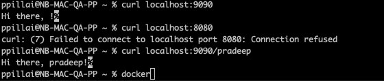

# Dockerize hello service

* Given:
    * hello service default exposed port is 8080.
    * hello service accepts option -addr :anyport

* Steps:
    * Create a new directory say pp-op-assign.
    * Copy the hello service binary to the directory.
    * Create a docker file Dockerfile. [Dockerfile](../Dockerfile)
    * Run the following docker command:
        > $ docker build -t hellosvc:1.0 .
    * This will create the image in local repository.
    * Verify image is present in the local repository.
        > $ docker image ls

    * Run the following docker command to expose svc with addr option:
        > $ docker run -it -p 9090:9090 --expose 9090 hellosvc:1.0 -addr :9090

            > 9090:9090 = <localhost port>:<docker container port>
            > --expose 9090 = docker container port (this is not required)
            > -addr :9090 = need for the service to listen to any port other than 8080

    * Verify the container is running.
        > $ docker container ls

    * Run Report
        * 
        * 

    * Stop the container
    * Run the following command to expose svc with default 8080 port:
        > $ docker run -it -p 9090:8080 hellosvc:1.0

    * Run Report
        * 
        * 
