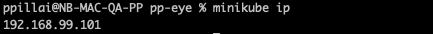
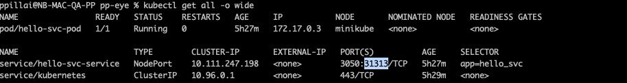
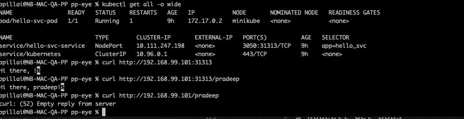

* Make sure you have followed the steps in - [Prepare Kubernetes cluster](/docs/PrepareKubernetes.md)

* Run the following command to get the ip.
    > $ minikube ip

    > 

* Run the following command to get info on all kubernetes component. 
    > $ kubectl get all -o wide

    * Get the exposed port for NodePort Type component
        > 

* Export the NodePort Port and minikube ip (This is required to run the cli)
    > $ export KUBECLUSTERIP=192.168.99.101

    > $ export NODEPORTPORT=31313

* In another terminal using the ip of minikube and port of NodePort do curl get call.

    > 

[HomePage](../README.md)
